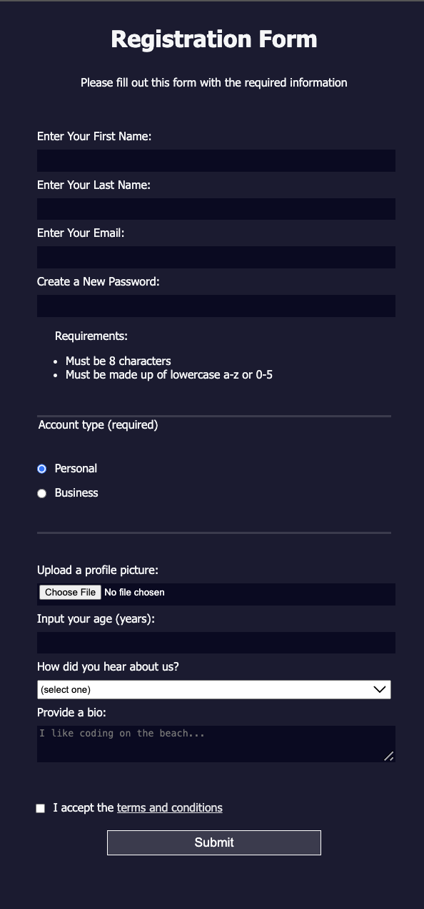

# Registration-Form

This was following a tutorial in the freeCodeCamp Responsive Web Design 
Certification course. 

This website utilizes input boxes, radio buttons, file inputs, dropdowns 
and other buttons to build a registration form page. It then uses CSS to 
style the page.

